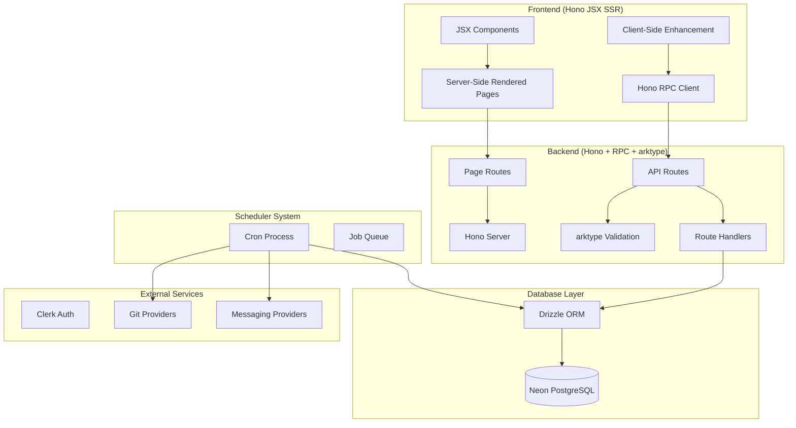
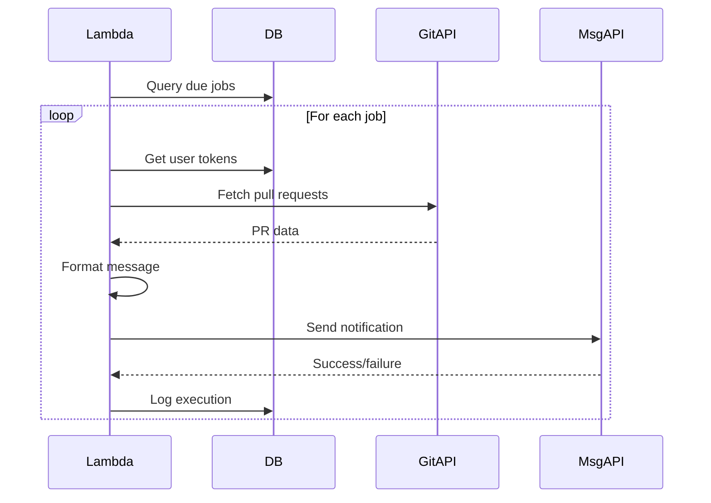
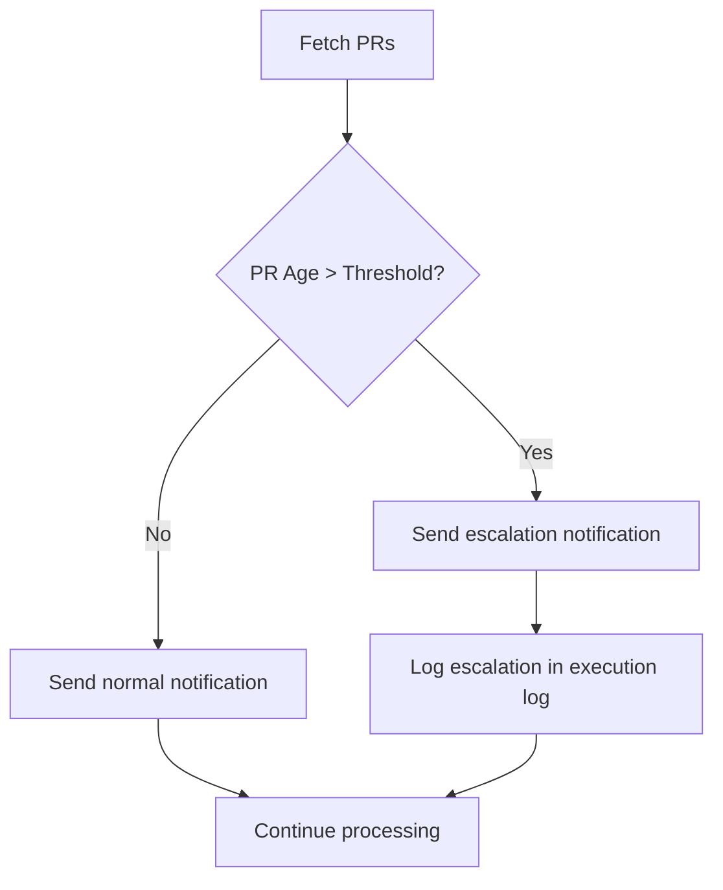

# Design Document

## Overview

The Git-Messaging Scheduler is a full-stack web application built with Node.js v22 and Hono that enables software engineers to receive automated notifications about open pull requests. The system integrates multiple git providers with messaging platforms through a configurable cron scheduling system.

### Key Design Principles

- **Modern Node.js**: Leveraging Node.js v22 with native ESM and latest features
- **Server-Side Rendering**: Using Hono JSX for fast SSR with excellent SEO and performance
- **Type-safe RPC**: Using Hono RPC for end-to-end type safety between client and server
- **Provider-agnostic**: Modular integration system supporting multiple git and messaging providers
- **User-centric**: Intuitive dashboard for non-technical configuration
- **Scalable**: Event-driven architecture supporting multiple users and schedules

## Architecture

### Project Structure

```
git-messaging-scheduler/
├── package.json                       # Node.js dependencies and scripts
├── tsconfig.json                      # TypeScript configuration
├── .env.example                       # Environment variables template
├── README.md                          # Project documentation
│
├── src/
│   ├── server.ts                      # Hono server entry point
│   ├── cron.ts                        # Cron job entry point
│   │
│   ├── routes/                        # Hono routes (pages + API)
│   │   ├── index.tsx                  # Landing page route
│   │   ├── dashboard.tsx              # Dashboard page route
│   │   ├── login.tsx                  # Login page route
│   │   └── api/                       # API routes with RPC
│   │       ├── providers.ts           # Provider management API
│   │       ├── cron-jobs.ts           # Cron job management API
│   │       └── auth.ts                # Authentication API
│   │
│   ├── components/                    # JSX components for SSR
│   │   ├── layout/
│   │   │   ├── Layout.tsx             # Main layout wrapper
│   │   │   ├── Header.tsx             # Navigation header
│   │   │   └── Footer.tsx             # Footer component
│   │   ├── providers/
│   │   │   ├── ProviderCard.tsx       # Provider connection card
│   │   │   └── ConnectionStatus.tsx   # Connection status indicator
│   │   ├── cron-jobs/
│   │   │   ├── CronJobList.tsx        # Cron job table/list
│   │   │   ├── CronJobForm.tsx        # Create/edit cron job form
│   │   │   ├── CronBuilder.tsx        # Cron expression builder
│   │   │   ├── FilterBuilder.tsx      # PR filter configuration
│   │   │   └── EscalationSettings.tsx # Escalation configuration
│   │   └── ui/
│   │       ├── Button.tsx             # Button component
│   │       ├── Modal.tsx              # Modal component
│   │       └── Toast.tsx              # Toast notification
│   │
│   ├── client/                        # Client-side JavaScript
│   │   ├── main.ts                    # Main client entry point
│   │   ├── api.ts                     # Hono RPC client
│   │   └── components/                # Client-side interactive components
│   │       ├── CronJobForm.ts         # Form interactions
│   │       └── ProviderCard.ts        # Provider connection handling
│   │
│   ├── lib/                           # Shared libraries and services
│   │   ├── providers/
│   │   │   ├── git/
│   │   │   │   ├── github.ts          # GitHub API integration
│   │   │   │   ├── bitbucket.ts       # Bitbucket API integration
│   │   │   │   └── gitlab.ts          # GitLab API integration
│   │   │   └── messaging/
│   │   │       ├── slack.ts           # Slack API integration
│   │   │       ├── teams.ts           # MS Teams API integration
│   │   │       └── discord.ts         # Discord API integration
│   │   ├── cron/
│   │   │   ├── scheduler.ts           # Cron job execution logic
│   │   │   ├── escalation.ts          # Escalation notification logic
│   │   │   └── filters.ts             # PR filtering logic
│   │   ├── database/
│   │   │   ├── client.ts              # Drizzle database client
│   │   │   ├── schema.ts              # Database schema definitions
│   │   │   └── queries/
│   │   │       ├── users.ts           # User-related queries
│   │   │       ├── providers.ts       # Provider-related queries
│   │   │       └── cron-jobs.ts       # Cron job queries
│   │   ├── auth/
│   │   │   └── clerk.ts               # Clerk authentication helpers
│   │   ├── validation/
│   │   │   └── schemas.ts             # arktype validation schemas
│   │   └── types/
│   │       ├── database.ts            # Database schema types
│   │       ├── providers.ts           # Provider interface types
│   │       └── api.ts                 # API request/response types
│   │
│   └── static/                        # Static assets
│       ├── favicon.ico                # Favicon
│       ├── styles.css                 # Global CSS styles
│       └── js/                        # Client-side JavaScript bundles
│
├── tests/
│   ├── unit/
│   │   ├── backend/
│   │   │   ├── services/              # Service layer tests
│   │   │   └── routes/                # Route tests
│   │   └── frontend/
│   │       └── components/            # Component tests
│   ├── integration/
│   │   ├── api.test.ts                # API integration tests
│   │   └── providers.test.ts          # Provider integration tests
│   └── e2e/
│       ├── auth.test.ts               # Authentication flow tests
│       ├── provider-connection.test.ts # Provider connection tests
│       └── cron-job-workflow.test.ts  # End-to-end cron job tests
│
├── dist/                              # Build output directory
│   ├── server.js                      # Compiled server
│   ├── cron.js                        # Compiled cron job
│   └── static/                        # Built static assets
├── esbuild.config.js                  # Build configuration
└── .env.example                       # Environment variables template
```

### Deployment Architecture

The application will be deployed as a Node.js application with two main entry points:

#### Main Application (`src/server.ts`)

- Serves server-side rendered pages via Hono JSX
- Handles all API routes via Hono RPC endpoints
- Manages OAuth callbacks and authentication
- Serves static assets and client-side JavaScript

#### Cron Function (`src/cron.ts`)

- Separate Node.js process or serverless function triggered every minute
- Executes scheduled cron jobs
- Handles pull request fetching and notification sending
- Manages escalation logic and tracking

#### File Organization Principles

- **Routes**: Hono routes for both pages (JSX SSR) and API (RPC) endpoints
- **Components**: JSX components for server-side rendering
- **Client**: Client-side JavaScript for progressive enhancement
- **Lib**: Shared libraries, services, and business logic
- **Static**: Static assets served by Hono
- **Tests**: Comprehensive testing suite with unit, integration, and e2e tests

### High-Level Architecture



### Deployment Architecture

The application runs as a single Hono server in both development and production:

#### Development & Production (Single Process)

- **Hono Server**: Port 3000 - Serves everything:
  - Server-side rendered pages (JSX)
  - API endpoints at `/api/*`
  - Static assets (CSS, JS, images)
- **Cron Process**: Separate Node.js process for scheduled job execution

#### Deployment Flow

1. **Build**: `npm run build` creates production-ready files
   - Server compiled to `dist/server.js`
   - Client JavaScript bundled to `dist/static/js/`
2. **Deploy**: Single `node dist/server.js` serves everything
3. **Cron**: Separate `node dist/cron.js` for scheduled tasks

## Node.js + Hono Configuration

### Package Configuration (`package.json`)

```json
{
  "name": "git-messaging-scheduler",
  "version": "1.0.0",
  "type": "module",
  "scripts": {
    "dev": "tsx watch src/server.ts",
    "build": "node esbuild.config",
    "start": "node dist/server",
    "cron": "node dist/cron",
    "test": "vitest",
    "test:e2e": "playwright test",
    "db:generate": "drizzle-kit generate",
    "db:migrate": "drizzle-kit migrate",
    "db:studio": "drizzle-kit studio",
    "lint": "eslint src --ext .ts,.tsx",
    "type-check": "tsc --noEmit"
  },
  "dependencies": {
    "hono": "^4.0.0",
    "@hono/node-server": "^1.8.0",
    "arktype": "^2.0.0-beta.0",
    "drizzle-orm": "^0.29.0",
    "postgres": "^3.4.0",
    "@clerk/clerk-js": "^5.0.0",
    "node-cron": "^3.0.3"
  },
  "devDependencies": {
    "@types/node": "^22.0.0",
    "typescript": "^5.3.0",
    "tsx": "^4.6.0",
    "esbuild": "^0.19.0",
    "vitest": "^1.0.0",
    "playwright": "^1.40.0",
    "eslint": "^8.55.0",
    "@typescript-eslint/eslint-plugin": "^6.14.0",
    "drizzle-kit": "^0.20.0"
  }
}
```

### TypeScript Configuration (`tsconfig.json`)

```json
{
  "compilerOptions": {
    "target": "ES2022",
    "lib": ["ES2022", "DOM", "DOM.Iterable"],
    "module": "ESNext",
    "skipLibCheck": true,
    "moduleResolution": "bundler",
    "allowImportingTsExtensions": true,
    "resolveJsonModule": true,
    "isolatedModules": true,
    "noEmit": true,
    "jsx": "react-jsx",
    "jsxImportSource": "hono/jsx",
    "strict": true,
    "noUnusedLocals": true,
    "noUnusedParameters": true,
    "noFallthroughCasesInSwitch": true,
    "baseUrl": ".",
    "paths": {
      "@/*": ["./src/*"]
    }
  },
  "include": ["src"],
  "exclude": ["dist", "node_modules"]
}
```

### Build Configuration (`esbuild.config.js`)

```javascript
import { build } from "esbuild";
import { glob } from "glob";

// Build server
await build({
  entryPoints: ["src/server.ts", "src/cron.ts"],
  bundle: true,
  outdir: "dist",
  platform: "node",
  target: "node22",
  format: "esm",
  external: ["postgres", "drizzle-orm"],
  minify: process.env.NODE_ENV === "production",
});

// Build client-side JavaScript
const clientFiles = await glob("src/client/**/*.ts");
if (clientFiles.length > 0) {
  await build({
    entryPoints: clientFiles,
    bundle: true,
    outdir: "dist/static/js",
    platform: "browser",
    target: "es2022",
    format: "esm",
    minify: process.env.NODE_ENV === "production",
  });
}

console.log("Build complete!");
```

### Development Workflow

The development setup is now much simpler with a single server:

1. **`npm run dev`**: Runs the Hono server with hot reloading

   - **Server**: `tsx watch src/server.ts` (runs on port 3000)
   - **SSR Pages**: Server-side rendered JSX components
   - **Client JS**: Progressive enhancement for interactivity

2. **`npm run build`**: Builds the entire application

   - **Server**: Compiles and bundles server code to `dist/`
   - **Client**: Bundles client-side JavaScript to `dist/static/js/`

3. **`npm start`**: Runs the production server

## Components and Interfaces

### Frontend Architecture

#### Server-Side Rendered Pages (Hono JSX)

##### Landing Page (`src/routes/index.tsx`)

- **Hero Section**: Value proposition with call-to-action
- **Features Section**: Git provider logos, messaging platform logos, cron scheduling visualization
- **Pricing/Signup**: Integration with Clerk authentication
- **Server-rendered**: Fast initial load with SEO benefits

##### Dashboard (`src/routes/dashboard.tsx`)

- **Provider Connections**: Server-rendered provider status with client-side interactivity
- **Cron Job Management**: Server-rendered job list with progressive enhancement
- **Authentication**: Server-side auth check with Clerk

#### JSX Components (Server-Side Rendered)

##### Layout Components

- **Layout**: Navigation, user menu, responsive design (server-rendered)
- **Header/Footer**: Navigation components with auth state
- **UI Components**: Button, Card, Modal components for consistent styling

##### Provider Management Components

- **ProviderCard**: Server-rendered connection status with client-side OAuth handling
- **ConnectionStatus**: Real-time status updates via client-side JavaScript

##### Cron Job Management Components

- **CronJobList**: Server-rendered table with client-side interactions
- **CronJobForm**: Server-rendered form with client-side validation and submission
- **CronBuilder**: Interactive cron expression builder (client-side enhanced)
- **FilterBuilder**: Dynamic PR filter configuration (client-side enhanced)

#### Client-Side Enhancement

- **Progressive Enhancement**: Server-rendered HTML enhanced with JavaScript
- **Hono RPC Client**: Type-safe API calls from client-side code
- **Minimal JavaScript**: Only interactive features require client-side code

### Backend API Structure

#### Hono RPC Routes + arktype Organization

Hono RPC provides end-to-end type safety between client and server. arktype provides excellent runtime validation with compile-time type inference.

```typescript
// src/lib/validation/schemas.ts - arktype validation schemas
import { type } from "arktype";

export const ConnectProviderSchema = type({
  code: "string",
  state: "string?",
});

export const CreateCronJobSchema = type({
  name: "string",
  cronExpression: "string",
  gitProviderId: "number",
  messagingProviderId: "number",
  escalationProviderId: "number?",
  escalationDays: "number?",
  prFilters:
    {
      tags: "string[]?",
      labels: "string[]?",
      titleKeywords: "string[]?",
    } + "?",
  sendWhenEmpty: "boolean?",
});

export const UpdateCronJobSchema = type({
  id: "number",
  "...": "CreateCronJobSchema",
});

// Extract TypeScript types from arktype schemas
export type ConnectProviderData = typeof ConnectProviderSchema.infer;
export type CreateCronJobData = typeof CreateCronJobSchema.infer;
export type UpdateCronJobData = typeof UpdateCronJobSchema.infer;

// src/routes/providers.ts - Hono RPC routes
import { Hono } from "hono";
import { type } from "arktype";
import { getAuthUrl, exchangeCodeForTokens } from "../lib/providers/index";

const ProviderSchema = type(
  "'github'|'slack'|'teams'|'discord'|'bitbucket'|'gitlab'"
);

const app = new Hono()
  .post("/auth-url/:provider", async (c) => {
    try {
      const provider = c.req.param("provider");
      const validationResult = ProviderSchema(provider);

      if (validationResult instanceof type.errors) {
        return c.json({ error: "Invalid provider" }, 400);
      }

      const state = crypto.randomUUID(); // CSRF protection
      const authUrl = await getAuthUrl(validationResult, state);

      // Store state in session/database for validation
      return c.json({ authUrl, state });
    } catch (error) {
      return c.json({ error: "Invalid provider" }, 400);
    }
  })
  .get("/callback/:provider", async (c) => {
    try {
      const provider = c.req.param("provider");
      const code = c.req.query("code") || "";
      const state = c.req.query("state");

      const queryData = { code, state };
      const validationResult = ConnectProviderSchema(queryData);

      if (validationResult instanceof type.errors) {
        return c.json(
          {
            error: "Invalid request",
            details: validationResult.summary,
          },
          400
        );
      }

      // Validate state for CSRF protection
      const tokens = await exchangeCodeForTokens(provider, code);
      // Store tokens in database for current user

      return c.json({ success: true });
    } catch (error) {
      return c.json({ error: "Invalid request" }, 400);
    }
  })
  .delete("/disconnect/:provider", async (c) => {
    try {
      const provider = c.req.param("provider");
      // Handle provider disconnection
      return c.json({ success: true });
    } catch (error) {
      return c.json({ error: "Failed to disconnect" }, 500);
    }
  });

export default app;

// src/routes/cron-jobs.ts - Cron job management routes
import { Hono } from "hono";
import {
  CreateCronJobSchema,
  UpdateCronJobSchema,
} from "../lib/validation/schemas";
import {
  createCronJob,
  getUserCronJobs,
  updateCronJob,
  deleteCronJob,
} from "../lib/database/queries/cron-jobs";
import { type } from "arktype";

const app = new Hono()
  .get("/", async (c) => {
    try {
      // Get user from Clerk session
      const userId = c.get("userId");
      const jobs = await getUserCronJobs(userId);
      return c.json({ jobs });
    } catch (error) {
      return c.json({ error: "Failed to fetch jobs" }, 500);
    }
  })
  .post("/", async (c) => {
    try {
      const body = await c.req.json();
      const validationResult = CreateCronJobSchema(body);

      if (validationResult instanceof type.errors) {
        return c.json(
          { error: "Invalid input", details: validationResult.summary },
          400
        );
      }

      const userId = c.get("userId");
      const job = await createCronJob(userId, validationResult);
      return c.json({ id: job.id, ...validationResult });
    } catch (error) {
      return c.json({ error: "Failed to create job" }, 500);
    }
  })
  .put("/:id", async (c) => {
    try {
      const body = await c.req.json();
      const validationResult = UpdateCronJobSchema(body);
      const id = c.req.param("id");

      if (validationResult instanceof type.errors) {
        return c.json(
          { error: "Invalid input", details: validationResult.summary },
          400
        );
      }

      const userId = c.get("userId");
      await updateCronJob(parseInt(id), userId, validationResult);
      return c.json({ success: true });
    } catch (error) {
      return c.json({ error: "Failed to update job" }, 500);
    }
  })
  .delete("/:id", async (c) => {
    try {
      const id = c.req.param("id");
      const userId = c.get("userId");
      await deleteCronJob(parseInt(id), userId);
      return c.json({ success: true });
    } catch (error) {
      return c.json({ error: "Failed to delete job" }, 500);
    }
  });

export default app;

// src/server.ts - Main Hono server
import { Hono } from "hono";
import { serve } from "@hono/node-server";
import { serveStatic } from "@hono/node-server/serve-static";
import { clerkMiddleware } from "./lib/auth/clerk";
import providersRoutes from "./routes/providers";
import cronJobsRoutes from "./routes/cron-jobs";

const app = new Hono();

// Authentication middleware
app.use("/api/*", clerkMiddleware());

// API routes
const apiRoutes = app
  .basePath("/api")
  .route("/providers", providersRoutes)
  .route("/cron-jobs", cronJobsRoutes);

// Export type for RPC client
export type ApiRoutes = typeof apiRoutes;

// Serve static files in production only
// In development, Vite dev server handles the frontend
if (process.env.NODE_ENV === "production") {
  app.use("/assets/*", serveStatic({ root: "./dist/public" }));
  app.use("/*", serveStatic({ path: "./dist/public/index.html" }));
}

const port = process.env.PORT ? parseInt(process.env.PORT) : 3000;

console.log(`Server is running on port ${port}`);
console.log(
  process.env.NODE_ENV === "production"
    ? "Serving static files from dist/public"
    : "Frontend served by Vite dev server on port 5173"
);

serve({
  fetch: app.fetch,
  port,
});
```

#### Type Safety with Hono RPC + arktype

Hono RPC provides excellent end-to-end type safety with arktype:

1. **arktype Validation**: Runtime validation with superior compile-time type inference
2. **TypeScript Integration**: Full TypeScript support in route handlers with better performance than Zod
3. **RPC Type Safety**: End-to-end type safety from client to server
4. **Shared Types**: Types are automatically inferred and shared between client and server

#### arktype Advantages over Zod

arktype provides several benefits for Hono RPC routes:

1. **Better Performance**: Faster runtime validation than Zod
2. **Superior Type Inference**: More accurate TypeScript types
3. **Cleaner Syntax**: More readable schema definitions
4. **Smaller Bundle Size**: Lighter weight than Zod

```typescript
// src/lib/types/api.ts - Shared API types with arktype
import {
  CreateCronJobSchema,
  UpdateCronJobSchema,
  ConnectProviderSchema,
} from "../validation/schemas";

// Extract TypeScript types from arktype schemas
export type CreateCronJobRequest = typeof CreateCronJobSchema.infer;
export type UpdateCronJobRequest = typeof UpdateCronJobSchema.infer;
export type ConnectProviderRequest = typeof ConnectProviderSchema.infer;

export interface ApiResponse<T = unknown> {
  success?: boolean;
  error?: string;
  data?: T;
}

export interface CronJobResponse extends CreateCronJobRequest {
  id: number;
  createdAt: string;
  lastExecuted?: string;
}

// src/frontend/hooks/useApi.ts - Type-safe Hono RPC client
import { hc } from "hono/client";
import type { ApiRoutes } from "../../server";

const client = hc<ApiRoutes>("/api");

export const useApi = () => {
  const createCronJob = async (data: CreateCronJobRequest) => {
    const response = await client["cron-jobs"].$post({
      json: data,
    });

    if (!response.ok) {
      throw new Error(`API Error: ${response.status}`);
    }

    return await response.json();
  };

  const updateCronJob = async (id: number, data: CreateCronJobRequest) => {
    const response = await client["cron-jobs"][":id"].$put({
      param: { id: id.toString() },
      json: { ...data, id },
    });

    if (!response.ok) {
      throw new Error(`API Error: ${response.status}`);
    }

    return await response.json();
  };

  const getCronJobs = async () => {
    const response = await client["cron-jobs"].$get();

    if (!response.ok) {
      throw new Error(`API Error: ${response.status}`);
    }

    return await response.json();
  };

  return {
    createCronJob,
    updateCronJob,
    getCronJobs,
  };
};

// src/frontend/components/cron-jobs/CronJobForm.tsx - Type-safe frontend usage
import React from "react";
import { useApi } from "../../hooks/useApi";
import type { CreateCronJobRequest } from "../../../lib/types/api";

export default function CronJobForm() {
  const { createCronJob } = useApi();

  const handleSubmit = async (data: CreateCronJobRequest) => {
    try {
      const result = await createCronJob(data);
      console.log("Job created:", result);
    } catch (error) {
      console.error("Failed to create job:", error);
    }
  };

  // Form implementation with full type safety
  return <div>/* Form JSX */</div>;
}
```

#### arktype Schema Examples

```typescript
// src/lib/validation/schemas.ts - Advanced arktype patterns
import { type } from "arktype";

// Union types with literals
export const ProviderType = type(
  "'github'|'slack'|'teams'|'discord'|'bitbucket'|'gitlab'"
);

// Complex nested objects with optional fields
export const CronJobFilters = type({
  tags: "string[]?",
  labels: "string[]?",
  titleKeywords: "string[]?",
  excludeAuthors: "string[]?",
  minAge: "number?", // days
  maxAge: "number?",
});

// Conditional validation
export const CronJobWithEscalation = type({
  name: "string",
  cronExpression: "string",
  gitProviderId: "number",
  messagingProviderId: "number",
  escalationProviderId: "number?",
  escalationDays: "number?",
  prFilters: "CronJobFilters?",
  sendWhenEmpty: "boolean?",
  // Conditional: if escalationProviderId is set, escalationDays is required
  "escalationDays?": "number",
}).pipe((job, ctx) => {
  if (job.escalationProviderId && !job.escalationDays) {
    return ctx.error(
      "escalationDays is required when escalationProviderId is set"
    );
  }
  return job;
});

// Extract types
export type CronJobFiltersData = typeof CronJobFilters.infer;
export type CronJobWithEscalationData = typeof CronJobWithEscalation.infer;
```

### Provider Integration Layer

#### Authorization Flow

The application uses OAuth 2.0 authorization code flow for connecting external
providers:

1. **Initiation**: User clicks "Connect Slack App" button on dashboard
2. **Auth URL Generation**: Frontend calls `/api/providers/slack/auth-url` to
   get authorization URL
3. **Redirect**: User is redirected to Slack's authorization page
4. **User Authorization**: User authorizes the app on Slack's website
5. **Callback**: Slack redirects back to
   `/api/providers/slack/callback?code=...&state=...`
6. **Token Exchange**: Backend exchanges authorization code for access/refresh
   tokens
7. **Storage**: Tokens are securely stored in database linked to user account

#### Git Provider Interface

```typescript
interface GitProvider {
  name: "github" | "bitbucket" | "gitlab";
  getAuthUrl(state: string): string; // Generate authorization URL
  exchangeCodeForTokens(code: string): Promise<TokenResponse>; // Exchange auth code for tokens
  refreshToken(refreshToken: string): Promise<TokenResponse>;
  getPullRequests(
    token: string,
    repositories?: string[],
    filters?: PRFilters
  ): Promise<PullRequest[]>;
}

interface PRFilters {
  tags?: string[];
  labels?: string[];
  titleKeywords?: string[];
}
```

#### Messaging Provider Interface

```typescript
interface MessagingProvider {
  name: "slack" | "teams" | "discord";
  getAuthUrl(state: string): string; // Generate authorization URL
  exchangeCodeForTokens(code: string): Promise<TokenResponse>; // Exchange auth code for tokens
  refreshToken(refreshToken: string): Promise<TokenResponse>;
  sendMessage(token: string, channel: string, message: string): Promise<void>;
  getChannels(token: string): Promise<Channel[]>;
}
```

### Cron Execution System

#### Job Processor

The cron lambda runs every minute and:

1. Queries for jobs scheduled in the current minute
2. Groups jobs by user to batch API calls
3. Executes jobs concurrently with rate limiting
4. Checks for pull requests requiring escalation based on age
5. Sends escalation notifications to alternate channels when needed
6. Logs execution results

#### Job Execution Flow



#### Escalation Logic

The system implements automatic escalation for pull requests that remain open beyond the configured timeframe:

1. **Age Calculation**: For each pull request, calculate days since creation
2. **Escalation Check**: Compare PR age against job's escalation threshold (default 3 days)
3. **Escalation Notification**: Send notifications to escalation channel with special formatting
4. **Escalation Tracking**: Track escalated PRs in execution logs to avoid duplicate notifications



## Data Models

### Database Schema (Drizzle)

```typescript
// Users table
export const users = pgTable("users", {
  id: serial("id").primaryKey(),
  clerkId: text("clerk_id").notNull().unique(), // Clerk user ID
  email: text("email").notNull(),
  createdAt: timestamp("created_at").defaultNow(),
  updatedAt: timestamp("updated_at").defaultNow(),
});

// Git provider connections
export const gitProviders = pgTable("git_providers", {
  id: serial("id").primaryKey(),
  userId: integer("user_id").references(() => users.id),
  provider: text("provider").$type<"github" | "bitbucket" | "gitlab">(),
  accessToken: text("access_token").notNull(),
  refreshToken: text("refresh_token"),
  expiresAt: timestamp("expires_at"),
  repositories: jsonb("repositories").$type<string[]>(),
  createdAt: timestamp("created_at").defaultNow(),
});

// Messaging provider connections
export const messagingProviders = pgTable("messaging_providers", {
  id: serial("id").primaryKey(),
  userId: integer("user_id").references(() => users.id),
  provider: text("provider").$type<"slack" | "teams" | "discord">(),
  accessToken: text("access_token").notNull(),
  refreshToken: text("refresh_token"),
  channelId: text("channel_id").notNull(),
  expiresAt: timestamp("expires_at"),
  createdAt: timestamp("created_at").defaultNow(),
});

// Cron jobs
export const cronJobs = pgTable("cron_jobs", {
  id: serial("id").primaryKey(),
  userId: integer("user_id").references(() => users.id),
  name: text("name").notNull(),
  cronExpression: text("cron_expression").notNull(),
  gitProviderId: integer("git_provider_id").references(() => gitProviders.id),
  messagingProviderId: integer("messaging_provider_id").references(
    () => messagingProviders.id
  ),
  escalationProviderId: integer("escalation_provider_id").references(
    () => messagingProviders.id
  ),
  escalationDays: integer("escalation_days").default(3),
  prFilters: jsonb("pr_filters").$type<PRFilters>(),
  isActive: boolean("is_active").default(true),
  sendWhenEmpty: boolean("send_when_empty").default(false),
  lastExecuted: timestamp("last_executed"),
  createdAt: timestamp("created_at").defaultNow(),
});

// Execution logs
export const executionLogs = pgTable("execution_logs", {
  id: serial("id").primaryKey(),
  cronJobId: integer("cron_job_id").references(() => cronJobs.id),
  executedAt: timestamp("executed_at").defaultNow(),
  status: text("status").$type<"success" | "error">(),
  pullRequestCount: integer("pull_request_count"),
  errorMessage: text("error_message"),
});
```

### Type Definitions

```typescript
// Pull request data structure
interface PullRequest {
  id: string;
  title: string;
  author: string;
  url: string;
  createdAt: Date;
  repository: string;
  status: "open" | "draft";
  labels: string[];
  tags: string[];
}

// Notification message format
interface NotificationMessage {
  text: string;
  pullRequests: PullRequest[];
  totalCount: number;
  jobName: string;
}
```

## Error Handling

### Authentication Errors

- **Token Expiration**: Automatic refresh with fallback to re-authentication prompt
- **Invalid Credentials**: Clear error messages with re-connection guidance
- **Rate Limiting**: Exponential backoff with user notification

### Provider API Errors

- **Network Failures**: Retry logic with circuit breaker pattern
- **API Changes**: Graceful degradation with error logging
- **Permission Issues**: User-friendly error messages with resolution steps

### Cron Execution Errors

- **Job Failures**: Individual job isolation to prevent cascade failures
- **Database Errors**: Transaction rollback with retry mechanisms
- **Timeout Handling**: Configurable timeouts with partial success reporting

## Testing Strategy

### Unit Testing

- **Provider Integrations**: Mock external APIs for reliable testing
- **Cron Logic**: Test scheduling algorithms and job execution
- **Escalation Logic**: Test PR age calculation and escalation triggers
- **Filter Logic**: Test PR filtering by tags, labels, and keywords
- **Database Operations**: Test with in-memory database for speed

### Integration Testing

- **OAuth Flows**: Test complete authentication workflows
- **End-to-End Scenarios**: User creates job → receives notification → escalation triggers
- **Filter Integration**: Test PR filtering with real provider APIs
- **API Endpoints**: Test all Fresh API routes with ArkType validation and authentication

### Performance Testing

- **Cron Scalability**: Test with multiple concurrent jobs
- **Database Performance**: Query optimization for large datasets
- **Rate Limiting**: Verify provider API limits are respected

### Testing Tools

- **Vitest**: Fast unit testing framework for Node.js and TypeScript
- **React Testing Library**: Component testing for React components
- **MSW**: Mock Service Worker for API mocking
- **Playwright**: End-to-end testing for critical user flows
- **Hono Test Utils**: Built-in testing utilities for Hono routes

## Production Deployment

### Single Server Architecture

In production, the application runs as a **single Node.js process** that serves both the API and static frontend files:

```
Production Server (Port 3000)
├── /api/*           → Hono RPC routes
├── /assets/*        → Static assets (JS, CSS, images)
└── /*               → React SPA (index.html for all routes)
```

### Simple Deployment

The application can be deployed to any Node.js hosting platform. The deployment process is straightforward:

1. **Build**: `npm run build` (creates `dist/` folder)
2. **Start**: `npm start` (runs the production server)
3. **Cron**: `npm run cron` (runs background job processor)

### Environment Variables

```bash
# Production Environment Variables
NODE_ENV=production
PORT=3000
DATABASE_URL=postgresql://...
CLERK_SECRET_KEY=sk_...
GITHUB_CLIENT_ID=...
GITHUB_CLIENT_SECRET=...
SLACK_CLIENT_ID=...
SLACK_CLIENT_SECRET=...
```

### Deployment Process

1. **Build**: `npm run build`

   - Compiles server TypeScript → `dist/server.js`
   - Builds React app → `dist/public/`

2. **Deploy**: Single command starts everything

   ```bash
   npm start  # Runs: node dist/server.js
   ```

3. **Cron Jobs**: Deploy separately as background service
   ```bash
   npm run cron  # Runs: node dist/cron.js
   ```

**Key Point**: Development uses 2 ports for better developer experience, Production uses 1 port for simplicity.
