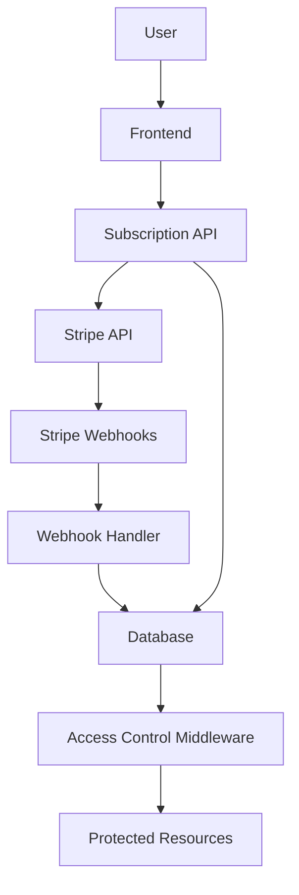

# Design Document

## Overview

The Stripe subscription system will implement a two-tier pricing model for the git messaging scheduler application. The system will integrate Stripe for payment processing, subscription management, and webhook handling to maintain synchronization between billing status and application features. The design leverages the existing Clerk authentication and PostgreSQL database infrastructure.

## Architecture

### High-Level Components

1. **Subscription Service Layer** - Handles Stripe API interactions and subscription logic
2. **Database Schema Extensions** - New tables for subscription and usage tracking
3. **Middleware Layer** - Enforces tier-based access controls
4. **Webhook Handler** - Processes Stripe events for subscription state changes
5. **Frontend Components** - UI for subscription management and upgrade flows

### Data Flow



## Components and Interfaces

### Database Schema Extensions ✅ _Implemented_

**Subscriptions Table**

```typescript
export const subscriptions = pgTable("subscriptions", {
  id: uuid("id").defaultRandom().primaryKey(),
  userId: uuid("user_id")
    .references(() => users.id, { onDelete: "cascade" })
    .notNull()
    .unique(), // One subscription per user
  stripeCustomerId: text("stripe_customer_id").notNull().unique(),
  stripeSubscriptionId: text("stripe_subscription_id").unique(),
  tier: subscriptionTierEnum("tier").notNull().default("free"),
  status: subscriptionStatusEnum("status").notNull().default("active"),
  currentPeriodStart: timestamp("current_period_start"),
  currentPeriodEnd: timestamp("current_period_end"),
  cancelAtPeriodEnd: boolean("cancel_at_period_end").default(false),
  createdAt: timestamp("created_at").defaultNow(),
  updatedAt: timestamp("updated_at").defaultNow(),
});

export const subscriptionTierEnum = pgEnum("subscription_tier", [
  "free",
  "pro",
]);
export const subscriptionStatusEnum = pgEnum("subscription_status", [
  "active",
  "canceled",
  "incomplete",
  "incomplete_expired",
  "past_due",
  "trialing",
  "unpaid",
]);
```

**Usage Tracking Table**

```typescript
export const usageTracking = pgTable("usage_tracking", {
  id: uuid("id").defaultRandom().primaryKey(),
  userId: uuid("user_id")
    .references(() => users.id, { onDelete: "cascade" })
    .notNull()
    .unique(), // One usage record per user
  gitProvidersCount: integer("git_providers_count").default(0),
  messagingProvidersCount: integer("messaging_providers_count").default(0),
  cronJobsCount: integer("cron_jobs_count").default(0),
  lastUpdated: timestamp("last_updated").defaultNow(),
});
```

**Usage Calculation Strategy**

Usage counts are maintained in the `usage_tracking` table and updated via triggers or application logic when resources are created/deleted. This provides better performance than real-time counting queries.

### Subscription Service

**Core Service Interface**

```typescript
interface SubscriptionService {
  // Customer management
  createCustomer(userId: string, email: string): Promise<string>;
  getCustomer(customerId: string): Promise<Stripe.Customer>;

  // Subscription management
  createSubscription(
    customerId: string,
    priceId: string
  ): Promise<Stripe.Subscription>;
  cancelSubscription(subscriptionId: string): Promise<Stripe.Subscription>;
  getSubscription(subscriptionId: string): Promise<Stripe.Subscription>;

  // Checkout and billing
  createCheckoutSession(
    customerId: string,
    priceId: string,
    successUrl: string,
    cancelUrl: string
  ): Promise<string>;
  createBillingPortalSession(
    customerId: string,
    returnUrl: string
  ): Promise<string>;

  // Webhook handling
  constructEvent(payload: string, signature: string): Stripe.Event;
  handleWebhookEvent(event: Stripe.Event): Promise<void>;
}
```

### Access Control Middleware

**Tier-based Access Control**

```typescript
interface TierLimits {
  gitProviders: number | null; // null = unlimited
  messagingProviders: number | null;
  cronJobs: number | null;
  minCronInterval: number; // hours
}

const TIER_LIMITS: Record<SubscriptionTier, TierLimits> = {
  free: {
    gitProviders: 1,
    messagingProviders: 1,
    cronJobs: 1,
    minCronInterval: 24,
  },
  pro: {
    gitProviders: null,
    messagingProviders: null,
    cronJobs: null,
    minCronInterval: 0,
  },
};
```

### API Endpoints

**Subscription Management**

- `POST /api/subscriptions/checkout` - Create Stripe checkout session
- `POST /api/subscriptions/portal` - Create billing portal session
- `GET /api/subscriptions/current` - Get current subscription status
- `POST /api/subscriptions/cancel` - Cancel subscription
- `POST /api/webhooks/stripe` - Handle Stripe webhooks

**Usage Tracking**

- `GET /api/usage/current` - Get current usage counts (calculated in real-time)
- `GET /api/usage/limits` - Get tier limits and remaining quota

## Data Models

### Subscription Model

```typescript
interface Subscription {
  id: string;
  userId: string;
  stripeCustomerId: string;
  stripeSubscriptionId?: string;
  tier: "free" | "pro";
  status: StripeSubscriptionStatus;
  currentPeriodStart?: Date;
  currentPeriodEnd?: Date;
  cancelAtPeriodEnd: boolean;
  createdAt: Date;
  updatedAt: Date;
}
```

### Usage Calculation Interface

```typescript
interface UserUsage {
  gitProvidersCount: number;
  messagingProvidersCount: number;
  cronJobsCount: number;
}
```

### Tier Configuration

```typescript
interface TierConfig {
  name: string;
  price: number; // in cents
  stripePriceId: string;
  limits: TierLimits;
  features: string[];
}
```

## Error Handling

### Stripe API Errors

- **Payment Failed**: Display user-friendly message, maintain current access
- **Subscription Creation Failed**: Rollback tier upgrade, log error
- **Webhook Signature Invalid**: Return 400, log security event
- **Rate Limiting**: Implement exponential backoff with retry logic

### Database Errors

- **Constraint Violations**: Handle gracefully with user feedback
- **Connection Issues**: Implement connection pooling and retry logic
- **Transaction Failures**: Ensure atomic operations for subscription changes

### Access Control Errors

- **Limit Exceeded**: Display upgrade prompt with clear messaging
- **Invalid Tier**: Log error and default to free tier
- **Usage Sync Issues**: Implement background reconciliation job

## Security Considerations

### Webhook Security

- Verify Stripe webhook signatures using endpoint secret
- Implement idempotency for webhook event processing
- Rate limit webhook endpoints to prevent abuse
- Log all webhook events for audit purposes

### Payment Data

- Never store payment method details in application database
- Use Stripe Customer Portal for payment method management
- Implement PCI compliance best practices
- Encrypt sensitive subscription metadata

### Access Control

- Validate user permissions before subscription operations
- Implement proper session management for billing portal
- Use HTTPS for all payment-related communications
- Audit subscription tier changes and access attempts

## Implementation Status

### ✅ Phase 1: Core Infrastructure (Completed)

- ✅ Database schema extensions (subscriptions and usage_tracking tables)
- ✅ Stripe SDK installation and configuration
- ✅ Environment variables setup for Stripe integration
- 🔄 Basic subscription service implementation (Next task)
- 🔄 Stripe customer creation and management (Next task)

## Implementation Phases

### Phase 1: Core Infrastructure

- ✅ Database schema extensions
- 🔄 Basic subscription service implementation
- 🔄 Stripe customer creation and management

### Phase 2: Subscription Management

- Checkout session creation
- Subscription lifecycle management
- Basic webhook handling

### Phase 3: Access Control

- Tier-based middleware implementation
- Usage tracking and limit enforcement
- Frontend integration for upgrade flows

### Phase 4: Advanced Features

- Billing portal integration
- Comprehensive webhook handling
- Usage analytics and reporting
